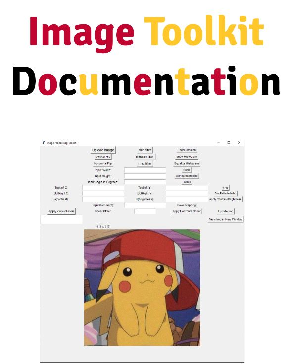

How to run program

run the command:
python imageToolkit.py

*Note if you get compile errors it is because you need to install the missing Libraries
These will be Pointed out in the error message** ex. PIL will need to be installed

For Detailed breakdown of all operations and implementation refer to PDF Documentation

<video autoplay loop muted playsinline width="500" height="500">
  <source src="demo.mp4" type="video/mp4">
  Your browser does not support the video tag.
</video>
